
<h1 align="center">付费问答系统的设计与实现</h1>

## 简介
付费问答系统：角色分为管理员、用户；功能包括问题发布与管理、回答查看与付费、用户信息管理、新闻信息展示、个人中心设置和后台数据管理。基于Spring Boot 3.3.0开发，提供简洁直观的用户体验。    --计算机毕业设计源码；毕设源码；java毕业设计源码

## 联系方式

<h3 align="center">获取完整代码与数据库文件 + 微信：deepguan QQ: 86050149 QQ群: 783742310</h3>

<h3 align="center">可帮忙远程部署 包运行成功！提供远程部署、修改代码、设计文档指导、代码讲解等服务！</h3>

## 功能介绍（完整见运行截图）
管理员：管理员可以登录和退出系统，访问和管理后台功能模块，包括用户管理、问题帖子管理、新闻信息管理和付费记录管理。管理员能够查看和修改用户信息，管理帖子和新闻内容，并查看和处理用户的付费记录。系统提供操作选项如查看、修改、删除等，以支持管理员对平台内容的全面管理。

用户：用户角色拥有登录、注册和退出功能，进入系统后可以浏览网站首页、问题帖子、新闻信息等内容。用户可以在个人中心查看和编辑个人信息，并发布问题或回答帖子内容，查看和参与讨论。部分问题回答可能需要用户付费查看。用户还可以通过简单的交互功能如搜索和导航，方便快捷地在平台中获取和分享信息。

## 运行截图
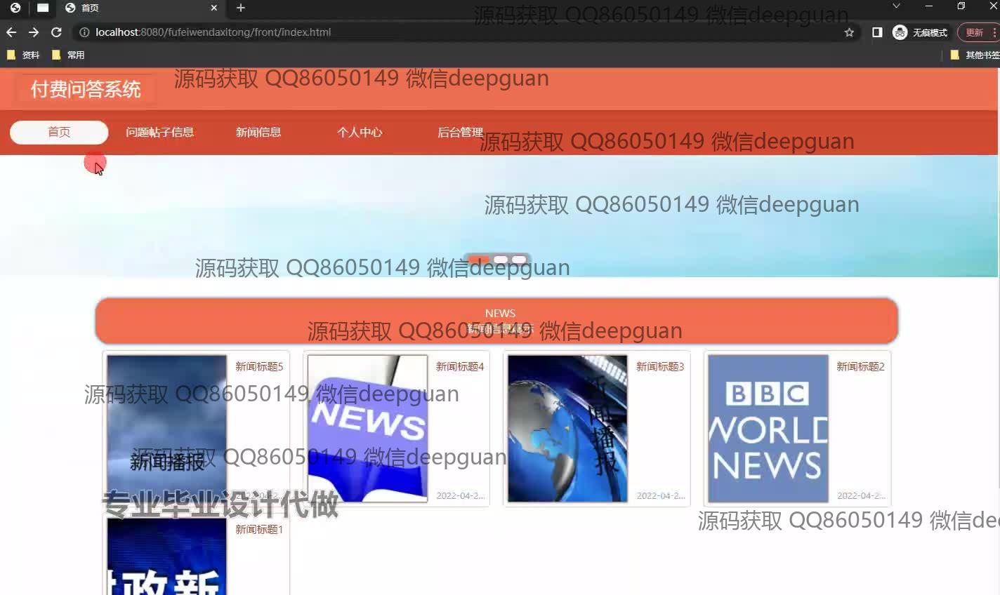
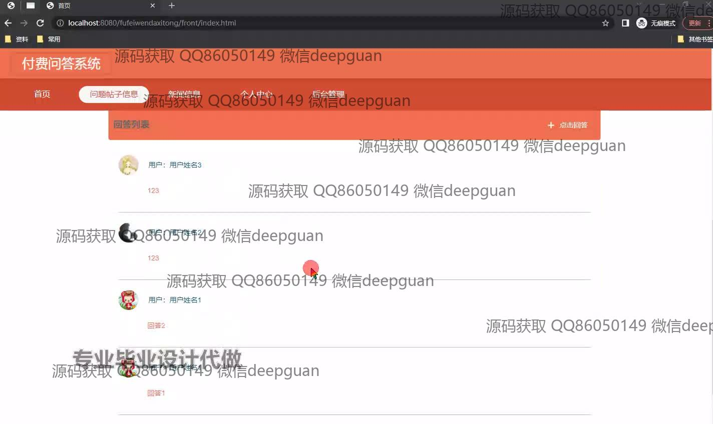
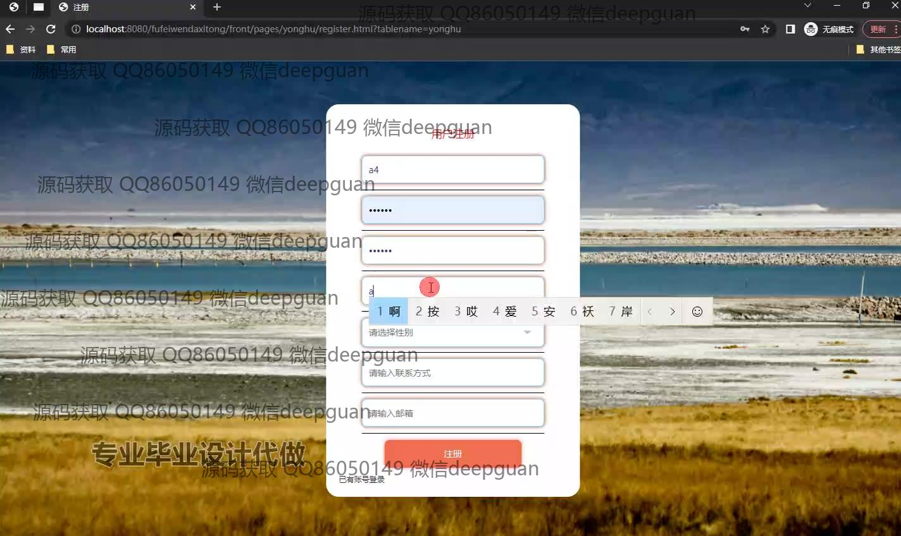
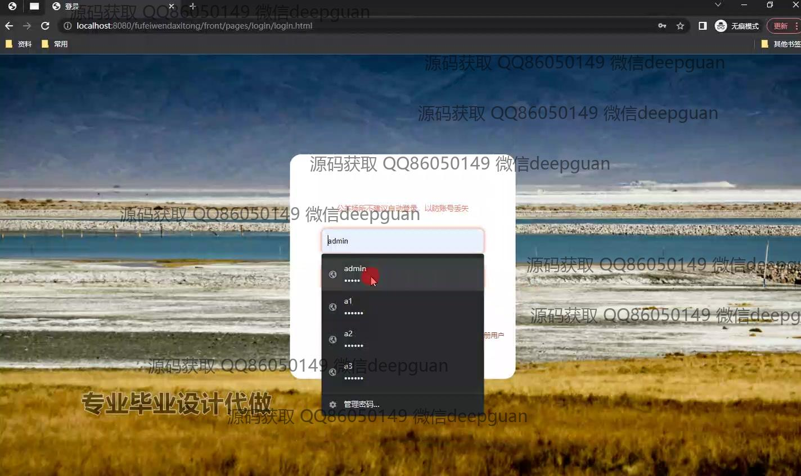
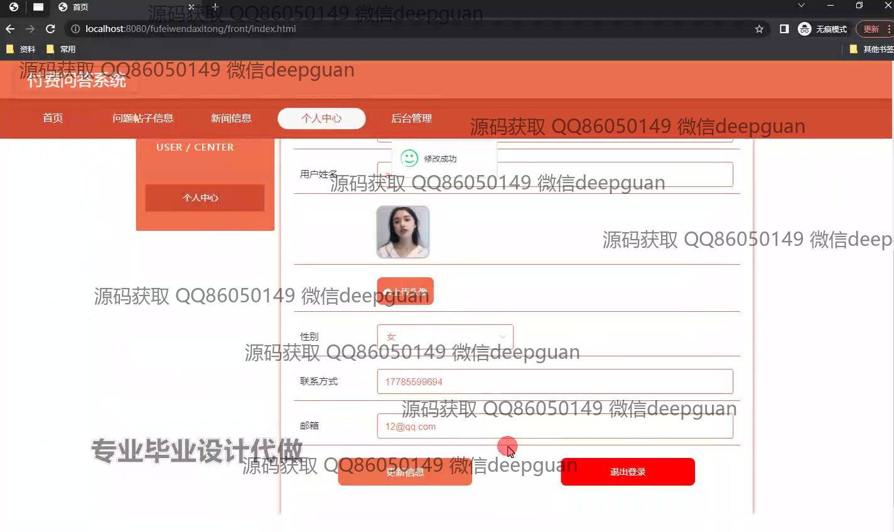
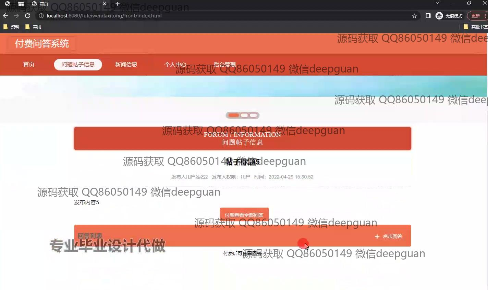
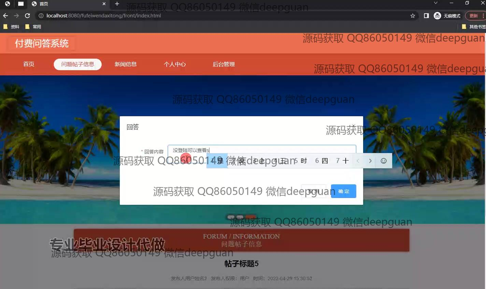
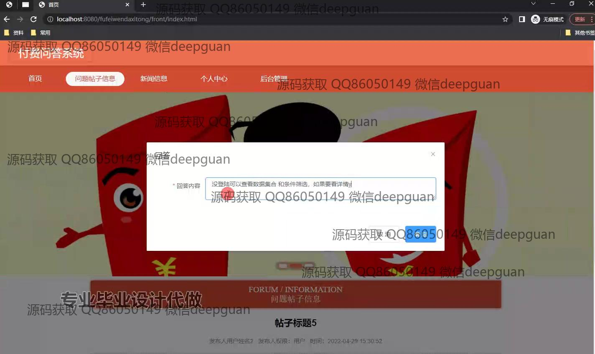
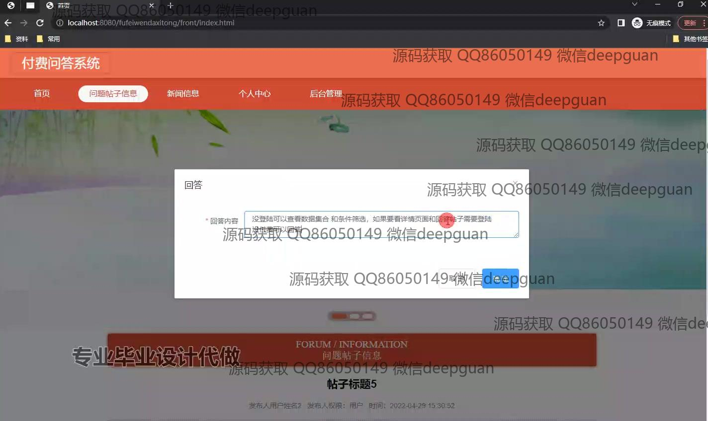
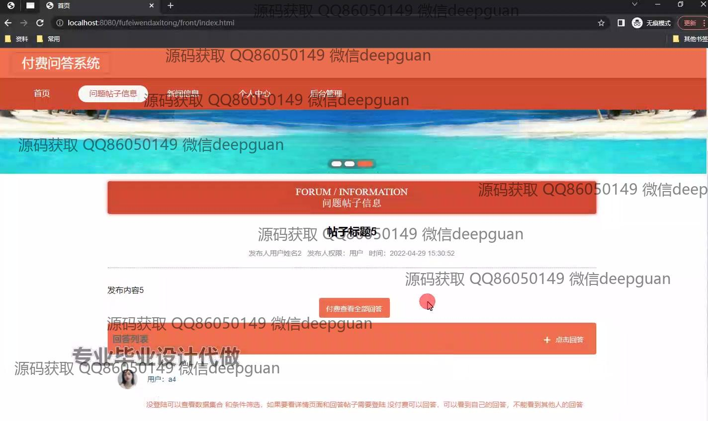
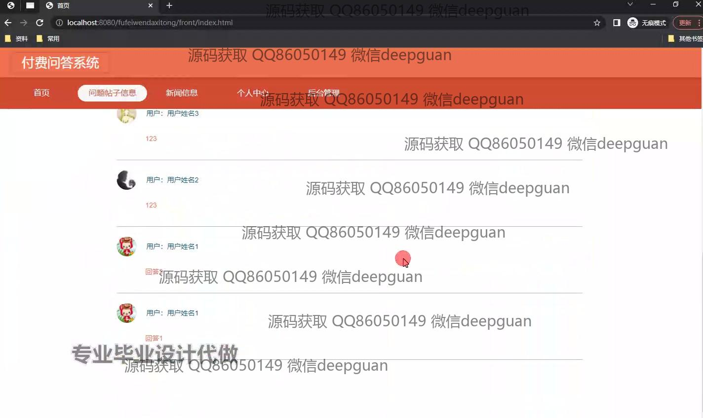
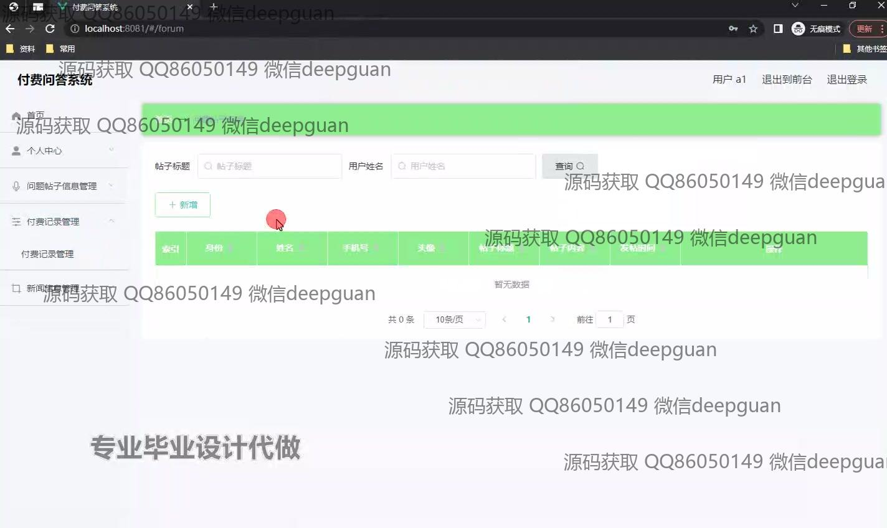
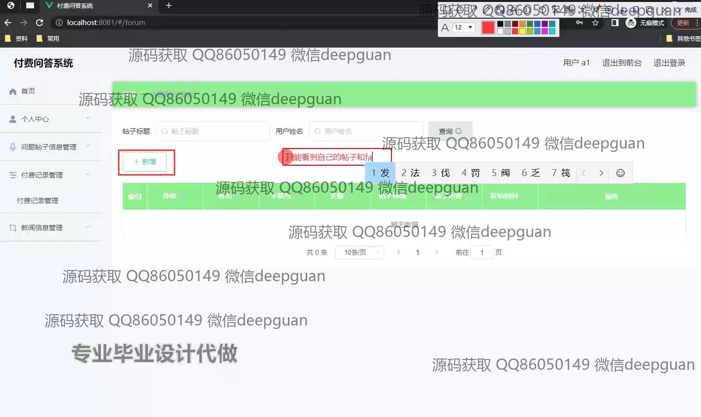
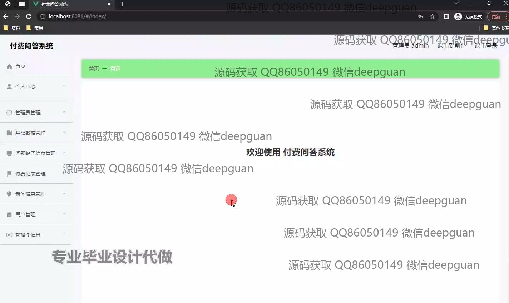
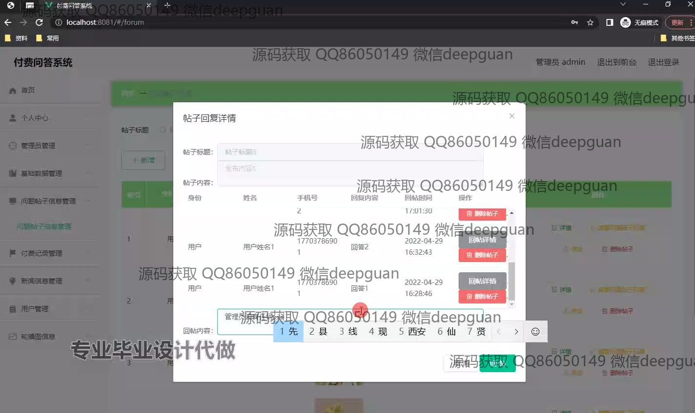
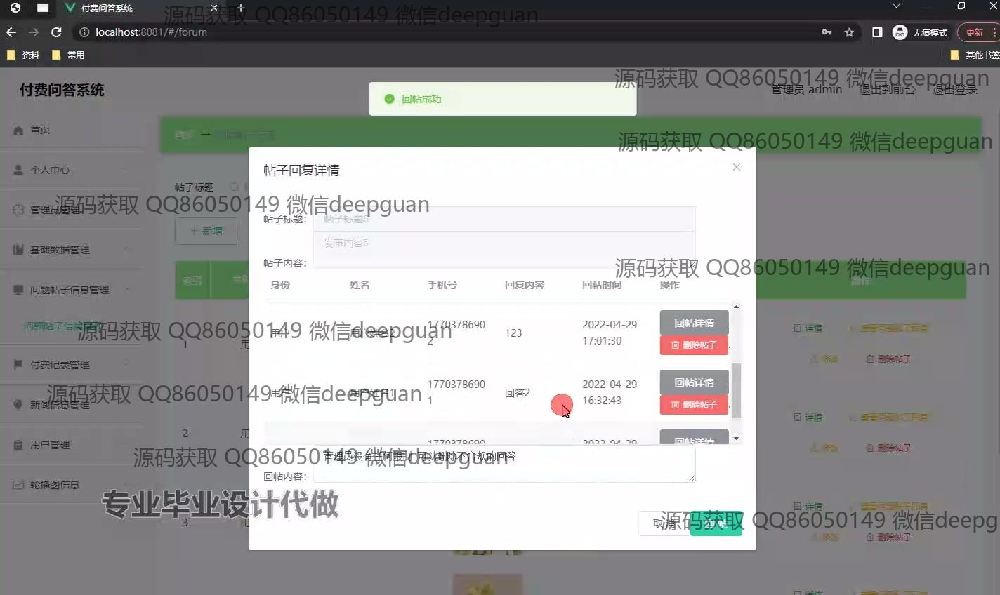

本代码来源于网络,仅供学习参考使用!

